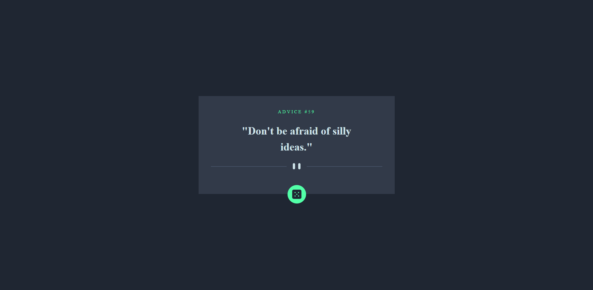

# Frontend Mentor - Advice generator app solution

This is a solution to the [Advice generator app challenge on Frontend Mentor](https://www.frontendmentor.io/challenges/advice-generator-app-QdUG-13db). Frontend Mentor challenges help you improve your coding skills by building realistic projects.

## Table of contents

- [Overview](#overview)
  - [The challenge](#the-challenge)
  - [Screenshot](#screenshot)
  - [Links](#links)
- [My process](#my-process)
  - [Built with](#built-with)
  - [What I learned](#what-i-learned)
- [Author](#author)
- [Acknowledgments](#acknowledgments)

## Overview
WiseGuidance is a powerful advice generator app that offers personalized and insightful guidance on a wide range of topics. It utilizes advanced algorithms and machine learning techniques to provide users with tailored recommendations based on their individual circumstances and preferences.

### The challenge

Users should be able to:

- View the optimal layout for the app depending on their device's screen size
- See hover states for all interactive elements on the page
- Generate a new piece of advice by clicking the dice icon

### Screenshot

### Links

- Solution URL: 
- Live Site URL: 

## My process

### Built with

- Semantic HTML5 markup
- CSS custom properties
- Flexbox
- CSS Grid
- Mobile-first workflow
- [React](https://reactjs.org/) - JS library

### What I learned

Throughout the code snippet provided, here's a summary of what you have learned:

- The app is built using React, a popular JavaScript library for building user interfaces.
- The useState hook is used to manage the state of the advice object, which holds the fetched advice data.
- The fetchAdvice function is an asynchronous function that fetches advice from the Advice Slip API using the fetch function.
- The useEffect hook is used to fetch advice when the component mounts and sets up an interval to fetch new advice every 2 seconds. It also clears the interval when the component unmounts.
- The rendered JSX displays the fetched advice and includes a button with a dice icon to manually fetch a new random advice.
- The app uses SCSS (Sassy CSS) for styling and imports necessary images.
- Instructions for installation, usage, customization, contributing, and licensing are included in the README.md file.

This code snippet demonstrates how to fetch data from an API, update the state, and render it in a React component. It also showcases the usage of hooks like useState and useEffect for managing state and performing side effects in functional components.Use this section to recap over some of your major learnings while working through this project. Writing these out and providing code samples of areas you want to highlight is a great way to reinforce your own knowledge.

## Author

- Website - [Jalaj Doraiburu](https://wolfgunblood.github.io/portfolio/)
- Frontend Mentor - [@wolfgunblood](https://www.frontendmentor.io/profile/wolfgunblood)
- Twitter - [@jalaj_dorai](https://twitter.com/jalaj_dorai)

## Acknowledgments

I would like to express our gratitude to Frontend Mentor (https://www.frontendmentor.io) for providing the design and inspiration for this project. Frontend Mentor offers a vast collection of design challenges and projects that allow developers to enhance their skills by building real-world applications.